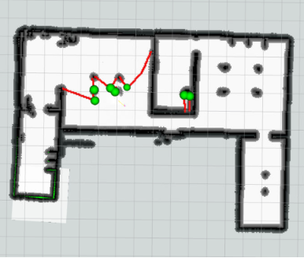
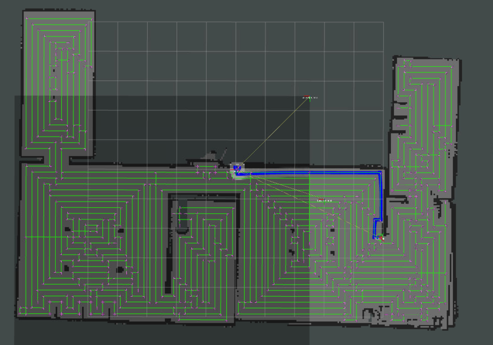

# Smart Cleaning Robot

## Launch and Files Introduction

### Launch in Simulation (gazebo and explore)

`roslaunch control_panel panel.launch`

(default: warehouse)

choose map: bookstore, house, hospital, turtlebot_house

you can input:

`roslaunch control_panel panel.launch world:=xxx`

it essentially includes:

#1 : Gazebo World Map
roslaunch (depends on the parameter passing)

#2 : gmapping(SLAM) + RViz
roslaunch turtlebot3_slam turtlebot3_slam.launch slam_methods:=gmapping

#3 : move_base (do not run if run #6)
roslaunch turtlebot3_navigation move_base.launch

#4: Explore_Lite (do not run if run #7)
roslaunch explore_lite explore.launch

#5: voice_vosk
rosrun control_panel_voice voice_vosk.py

#6: move_base controller (must run #7, #8 together)
rosrun control_panel_voice move_base_controller.py

#7: explore_controller (must run #6, #8 together)
rosrun control_panel_voice explore_controller.py

#8: control_panel
rosrun control_panel_voice control_panel.py

### Other related: (for test or other usage)

#1：warehouse gazebo map only (with turtlebot3)
roslaunch sweep world_sim.launch

#2：launch SLAM only
roslaunch turtlebot3_slam turtlebot3_slam.launch

#3：launch navigation only
roslaunch turtlebot3_navigation move_base.launch

#4：run RViz only
rosrun rviz rviz

#5: launch teleop (only in test now, will be replaced soon)
roslaunch turtlebot3_teleop turtlebot3_teleop_key.launch

## Proposal

The proposal document is available in the `/attached_files` folder as a PDF.

## Project Overview

This project focuses on developing a cleaning robot with autonomous navigation capabilities. The robot utilizes frontier exploration for mapping and voice control for operational commands.

## Update: Week Oct. 30 - Nov. 5

- **Implemented**:
  - Frontier exploration using the `explore_lite` package, which generates real-time maps.
  - Voice control functionalities for basic commands.
- **Next Steps**:
  1. **Integrate** all functions to demonstrate a complete working system.
  2. **Develop custom exploration and planning code** to better suit practical applications, focusing on enhancing efficiency and adaptability.

## Update: Week Nov. 5 - Nov. 13

- **Implemented**:

  - **Global Path Planning**: Integrated `full_coverage_path_planner` to design an efficient path covering the entire workspace, ensuring thorough cleaning coverage with minimal retracing.
  - **Path Tracking Control**: Implemented motion control with `tracking_pid` for precise path-following capabilities. This feature improves the robot's accuracy in adhering to planned paths, enabling smooth and responsive navigation along coverage paths.
- **Next Steps**:

  1. **System Integration**: Integrate `explore_lite`, `full_coverage_path_planner`, and `tracking_pid` functionalities for a fully autonomous demonstration, combining exploration, global path planning, and motion control.
  2. **Demo Preparation**: Prepare a complete demo that showcases exploration, global coverage, and path-following capabilities in a unified system.

## Visual Demonstrations

- **Map Generated by `explore_lite`**:
  
- **Path Planning with CCPP**:
  

## Videos

Separate video demonstrations for each functionality are available as `.mp4` files:

- [Frontier Exploration Video](attached_files/explore_lite.mp4)
- [CCPP Path Planning Video](attached_files/ccpp.mp4)
