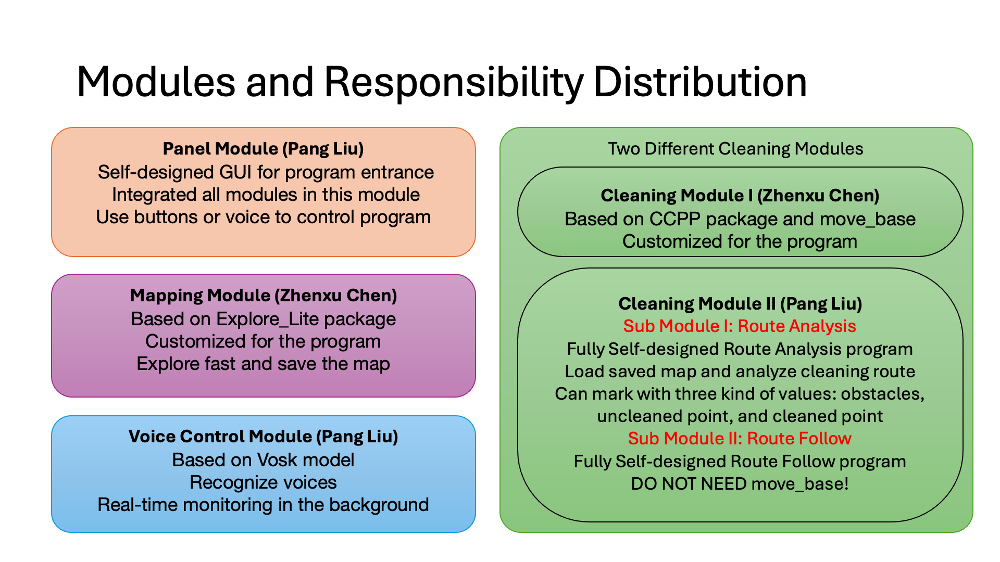
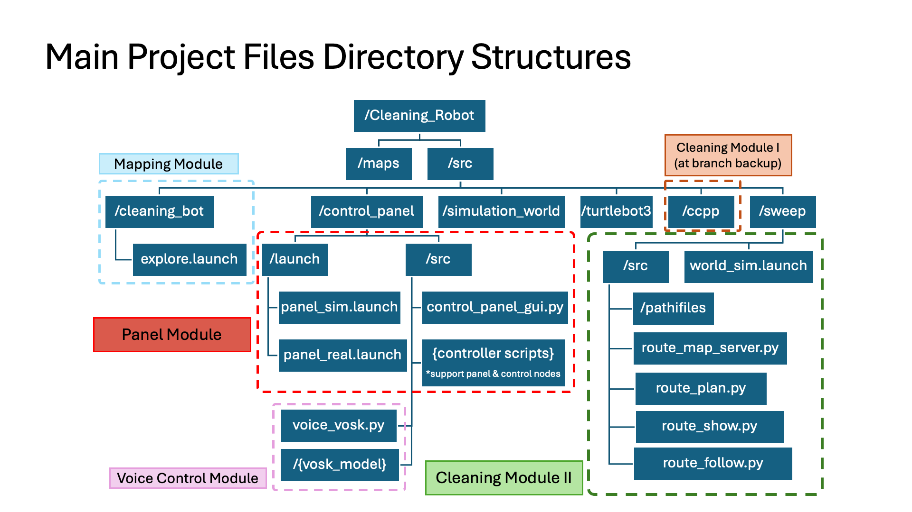

# **Smart Cleaning Robot**

## **Overview**

This is a ROS-based autonomous cleaning robot that integrates indoor mapping, voice control, and innovative cleaning functionalities. This project features expandable modules, making it a valuable tool for research, education, and real-world applications.

### **Key Features**

- **GUI Control Panel**: A user-friendly interface to manage all modules without command-line interaction.
- **Voice Control**: Real-time voice recognition for hands-free operation.
- **Mapping**: Efficient exploration and map saving using the Explore_Lite package.
- **Cleaning**: Two cleaning modules for full-coverage path planning, including a fully self-designed solution.

---

## **Getting Started**

### **Program Entry**

To start the program:

1. **For Simulation**:

  Remember to set localhost settings in ~/.bashrc

```bash
   roslaunch control_panel panel_sim.launch
```

2. **For Real Robot**:

  Remember to set real IP settings in ~/.bashrc and update turtlebot3's settings

```bash
   roslaunch control_panel panel_real.launch
```

No additional commands are required—the GUI handles all controls.

---

## **System Architecture**

### **Abstraction Modules**



### **Directory Structure**



Note: The Cleaning Module I (CCPP) is not in branch `master`, please see its implementation in branch `backup`.

---

## **Modules and Responsibilities**

### **1. Panel Module**

- **Developer**: Pang Liu
- **Description**:
  - Self-designed GUI for controlling all program modules.
  - Provides buttons and voice control integration for seamless operation.
- **Key Features**:
  - Start SLAM, exploration, and cleaning processes.
  - Save and load maps.
  - Route analysis and visualization in RViz.
  - Robot movement control.
  - Developer-friendly logs for debugging.


### **2. Voice Control Module**

- **Developer**: Pang Liu
- **Description**:
  - Real-time voice recognition using the **Vosk model**.
  - Publishes recognized commands to the `voice_commands` topic.
  - Enables voice-activated control of exploration and cleaning.


### **3. Mapping Module**

- **Developer**: Zhenxu Chen
- **Description**:
  - Based on the **Explore_Lite** package, customized for fast exploration and map saving.
- **Workflow**:
  1. **Start SLAM**: Launches `turtlebot3_slam.launch` for SLAM and RViz.
  2. **Start Exploration**: Begins autonomous exploration using `explore.launch`.
  3. **Save Map**: Saves the map as `.pgm` and `.yaml` files in the `/maps` directory.
  4. **Finish Mapping**: Stops SLAM and exploration nodes.


### **4. Cleaning Modules**

#### **Cleaning Module I**

- **Developer**: Zhenxu Chen
- **Description**:
  - Based on the **CCPP package** for full-coverage path planning and cleaning.
  - Utilizes `move_base` for navigation.

Note: Cleaning Module I is developed at branch `backup`


#### **Cleaning Module II**

- **Developer**: Pang Liu
- **Description**:
  - Fully self-designed cleaning functionality split into two submodules:
    - **Route Analysis Submodule**:
      - Reads saved maps and analyzes routes using a three-value map (-1 for obstacles, 0 for uncleaned areas, 1 for cleaned areas).
      - Plans paths using sampling intervals and a greedy algorithm to find valid connections.
    - **Route Follow Submodule**:
      - Executes the planned path, marking cleaned areas in real-time (still under debugging).


---

## **How to Use**

### **Control Panel Buttons**

- **Start SLAM**: Launches SLAM and RViz.
- **Start/Stop Exploration**: Begins or halts autonomous exploration.
- **Save Map**: Saves the current map to the `/maps` directory.
- **Analyze Route**: Uses `route_plan.py` to plan paths based on the saved map.
- **Show Route**: Visualizes the planned route in RViz.
- **Start Cleaning**: Executes the cleaning routine (based on the selected cleaning module).
- **Robot Control**: Allows manual control of the robot via `/cmd_vel`.
- **Quit Program**: Shuts down the system.

---

## **Key Technologies**

1. **Mapping Module**:
   - **SLAM**: Uses GMapping for real-time map creation and localization.
   - **Explore_Lite**: Implements frontier-based exploration.
2. **Cleaning Module II**:
   - **Route Analysis**:
     - Reads maps as `OccupancyGrid` messages.
     - Processes maps using NumPy for obstacle inflation and path planning.
     - Generates waypoints with greedy algorithms.
   - **Route Follow**:
     - Executes planned routes, dynamically updating cleaned areas in RViz.
3. **Voice Control Module**:
   - Powered by the Vosk speech recognition model for offline voice command processing.

---

## **Future Plans**

- Refine and debug the Route Follow submodule.
- Open-source the project to foster collaboration on smart cleaning robot innovations.
- Create a tutorial for building autonomous cleaning robots step-by-step.
- Expand the frontier exploration module with self-designed algorithms.

---

## **Demo Videos**

- Simulation in Gazebo demo will release soon.
- Real world demo will release soon.

---

## **Contributors**

- **Pang Liu**: Panel Module, Voice Control, Cleaning Module II.
- **Zhenxu Chen**: Mapping Module, Cleaning Module I.
